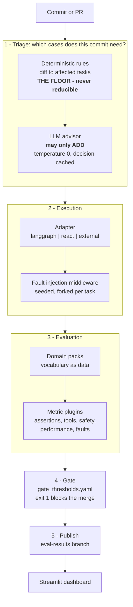
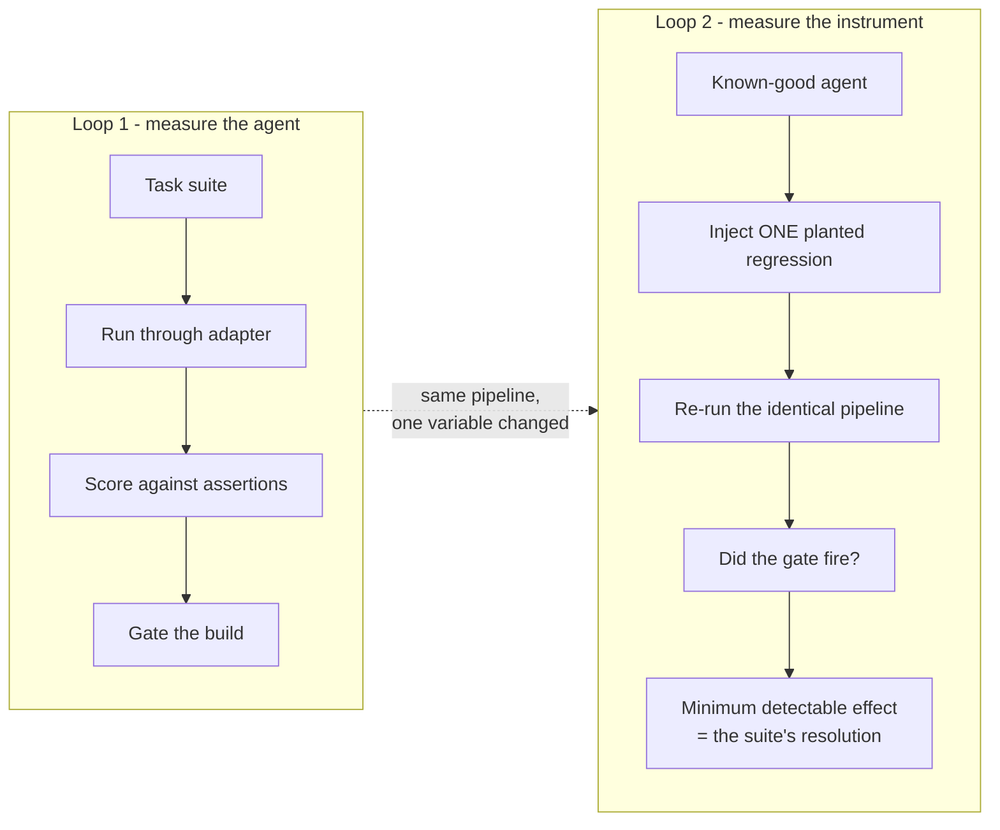
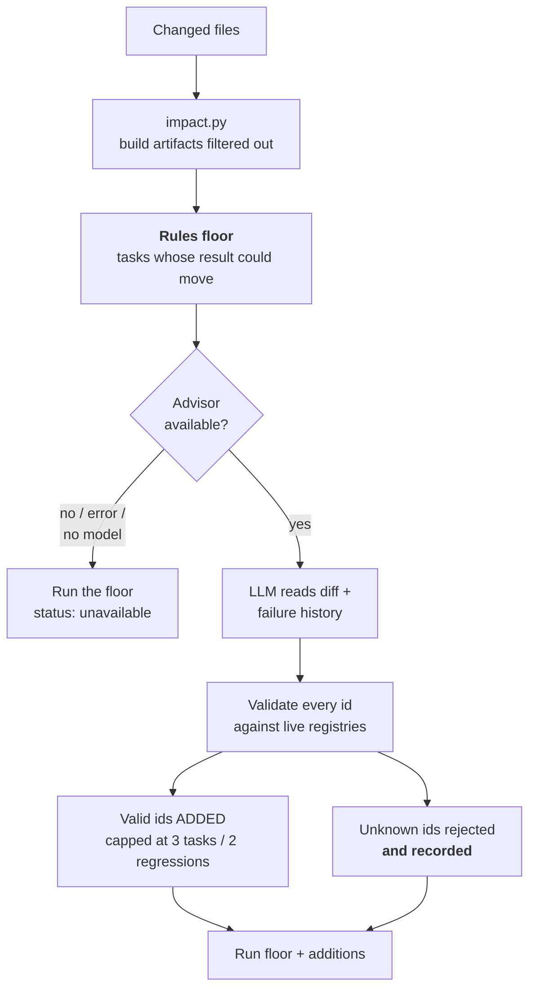
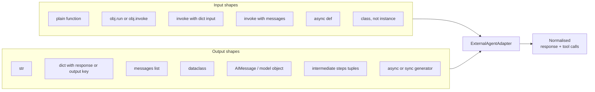
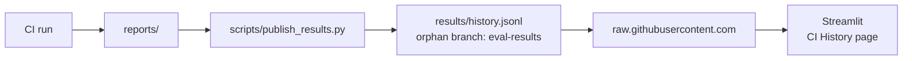

# Agent Conformance & Regression Gate

A pre-production gate for AI agents: pick the cases a commit actually needs, run
them against any agent from any framework, assert machine-checkable outcomes, and
block the build when quality regresses.

It also does something most evaluation tooling does not — it **tests the test
suite**. Planted regressions are injected on purpose to verify the suite can
still detect them, and the smallest degradation it can resolve is reported as a
number.

---

## Why the second part matters

A suite that has quietly lost the ability to detect a regression still reports
green. Nothing about the output distinguishes it from a suite that works.

That is not hypothetical. Building this repo surfaced defects that made the
headline number meaningless:

| Defect | Effect |
|---|---|
| `FaultLogEntry` had no `type` field, but five call sites read it | Regression catch rate fell through to its `else 1.0` default. "100% detection" was **structurally guaranteed and never measured** |
| Fault patch targets named the definition site, not the lookup site | Every tool-layer fault was a **no-op**. Nothing was ever actually injected |
| `unittest.mock.patch` is not thread-safe | Under concurrency, leaked mocks corrupted unrelated tasks and later experiment arms |
| A process-global `InMemoryCache` was installed at import | Seeds 2–5 replayed seed 1's response. Five samples were one sample and four copies; `stdev` was 0 by construction |
| `actual in target` is trivially true for an empty string | An agent that returned **nothing** scored a full exact match. A run whose every task failed reported a global average of **0.549** |
| Performance scored latency and cost only | A task that crashed returned instantly and cost nothing, so it scored **1.0**. The faster an agent failed, the better it looked |

Each produced a confident, green, entirely fictional result.

**The governing invariant, from which most of this design follows:**

> Something unmeasured must never read as passing.

Its corollary is that **under-selecting is the dangerous failure**. Running too
few cases produces a fast green result that proves nothing; running too many only
costs time. Every default in this repo resolves that trade-off the same way.

---

## Architecture



Each stage is a separate module with a declared contract, so a stage can be
replaced without touching the others. The suite runs the same code path in CI, in
a demo, and in the experiment that measures the suite itself — a harness whose
demo path differs from its CI path is measuring neither.

### The two loops



**Loop 1** is standard. **Loop 2** takes a known-good agent, injects one planted
regression, re-runs the *identical* pipeline, and checks whether the gate
actually fired — repeated across regressions of decreasing severity to derive the
**minimum detectable effect**.

Loop 2 is what lets a detection claim be stated with its conditions attached
instead of as an unqualified percentage.

---

## Architecture decisions

Each decision below is recorded with the evidence that produced it, because a
threshold or a design choice whose provenance is unknown cannot be defended.

### 1. Assertions, not LLM judges

Every metric is deterministic Python reading observed state and tool calls. A run
needs no API key, spends no judge tokens, and returns the same verdict every
time.

*Why:* putting a model between a code change and its verdict is the opposite of
what a merge blocker is for. DeepEval supplies the runner, the report and the
exit code; this project supplies the measurements.

### 2. The triage advisor may only add, never remove

Deterministic rules set a floor from the diff. An LLM advisor reads the diff and
the failure history and may only **widen** the set.

*Why:* an advisor that could shrink the set could produce a fast green build
proving nothing, and its reasoning is not reproducible, so no reviewer could tell
it had happened. Restricted to adding, the worst case is wasted time.

*Evidence:* given a loose brief, the advisor added the full cap of 10 tasks and
turned a 7-task selection into 17 — with one generic reason copy-pasted across
four tasks. The prompt now demands a specific mechanism per suggestion and the
caps are 3 tasks / 2 regressions.

### 3. Unmeasured is a third state, not a pass

`MetricResult.measured=False` excludes a result from aggregates rather than
counting it as either a pass or a failure.

*Why:* both alternatives misreport the agent. Applied to: an undeclared domain
pack, a task with no `expected_answer`, a foreign agent whose tool calls are
unobservable, and an execution that crashed.

### 4. Cache at the run and decision level, never at the LLM level

`RegressionExperiment` caches verdicts per `(target, provider, model, suite hash,
arm, seed)`. Triage caches the advisor's raw proposal per commit. There is no
global LLM cache, and a test asserts none is installed.

*Why:* seeds exist to sample a stochastic agent. A process-global LLM cache
collapses that distribution to a single sample while still reporting five, which
makes the confidence intervals describe replicas rather than runs.

### 5. temperature 0 is not determinism

The advisor runs at temperature 0 **and** its decision is cached against the
inputs that define it.

*Evidence:* three separate processes, one unchanged diff, Gemini at temperature
0 — three different proposals. The floor was identical every time, which is why
the gate stays defensible, but the reported test set moved. What is cached is the
raw proposal, not the finished decision, so validation re-runs on replay and a
task deleted since is rejected rather than resurrected.

### 6. Mock by default; live model by explicit configuration

`LLM_PROVIDER=mock` is the default everywhere. CI resolves to `google` only when
`GOOGLE_API_KEY` exists in repository secrets.

*Why:* a fresh clone, the test suite and a forked PR all work with no key and
reproducibly. `p95_latency` is 0.25s for the rule-based path and
`p95_latency_real_model` is 60s otherwise — one number for both would fail every
real run for a reason that says nothing about the agent.

### 7. API keys are exported to `os.environ`

`app/config.py:_export_keys_to_environ()` publishes configured keys into the
process environment. Existing environment variables win.

*Why:* pydantic-settings reads `.env` into `settings` without touching
`os.environ`. An agent handed over for evaluation builds its own client and reads
`os.environ` — so a key that lived only in `.env` was invisible to it and every
task failed with "API key required", which the suite then scored as an agent
defect.

### 8. History on a git branch, not a database

Every CI run appends its summary to an orphan `eval-results` branch, which the
deployed dashboard fetches over HTTP.

*Why:* the data is append-only and write-once, the repository already has
authentication and retention, and append-only NDJSON means concurrent runs cannot
corrupt earlier history. A database would be one more thing to provision, secure
and pay for.

---

## Quickstart

```bash
python -m venv .venv && .venv/Scripts/activate     # Windows
pip install -r requirements.txt

python demo_pipeline.py                 # Loop 1: triage, run, evaluate, report
python -m app.evaluation.gate_check     # enforce thresholds, exit 1 on failure
python run_experiment.py --seeds=5 --target=react   # Loop 2: measure the suite
python run_ablation.py --seeds=5        # baseline vs improved variants
python run_task.py my_task.json         # run one ad-hoc task, print its verdict
streamlit run dashboard.py              # visualise the reports
pytest                                  # 168 tests

# The same suite through DeepEval's runner (adds its report + CI exit code)
deepeval test run tests/test_deepeval_suite.py
```

No API key is needed. `LLM_PROVIDER` defaults to `mock`, which forces the agent's
deterministic rule-based path, so every run is reproducible.

To use a real model, copy `.env.example` to `.env` and fill it in:

```bash
LLM_PROVIDER=google
MODEL_NAME=gemini-2.5-flash
GOOGLE_API_KEY=...
```

`.env` is gitignored. The **test suite ignores it deliberately** and always runs
in mock mode — set `EVAL_ALLOW_LIVE_TESTS=1` to opt a run into live calls.
Without that, adding a `.env` silently turned the unit tests into billed model
calls: they went from 0.6s to 32s and failed outright when the key was absent.

On Windows, set `PYTHONIOENCODING=utf-8` before `deepeval test run` — its console
output contains characters cp1252 cannot encode.

**On a managed Windows machine**, Application Control may block `uuid_utils`'
native wheel by file hash. `langchain_core` hard-imports it with no fallback, so
a blocked wheel makes the whole project unimportable rather than merely failing a
test. Downgrade that one wheel after installing:

```bash
pip install --no-deps uuid_utils==0.10.0
```

It is deliberately not pinned in `requirements.txt`: `langchain-core` and
`langsmith` both require `uuid-utils>=0.12.0`, so pinning 0.10.0 there is
unsatisfiable — pip either refuses to resolve or backtracks to an ancient
`langchain-core` whose `Reviver` has no `allowed_objects`, which `langgraph` then
crashes on at import with a `TypeError` naming neither package.

Everything generated lands in `reports/` and is gitignored. No run dirties the
working tree.

---

## Layout

```
app/
  adapters/      the contract every agent target implements
                 base.py · langgraph.py · react.py · external.py
                 registry.py · factory.py · __init__.py (auto-discovery)
  agent/         the device under test (LangGraph travel assistant)
  benchmarks/    suites.py (hashed task sets) · runner.py (per-task isolation)
                 impact.py (diff to affected tasks) · selection.py
                 providers/ (import foreign benchmark formats)
  evaluation/    engine.py · metrics/ · experiment.py · statistics.py
                 triage.py · gate_check.py · analyzer.py · comparator.py
  faults/        22 fault plugins, middleware, seeded injection engine
  packs.py       domain vocabulary contract
  pricing.py     token cost, loaded from pricing.yaml

examples/their_agent.py   a worked third-party agent, imports nothing from app/
packs/travel.yaml         what "destructive tool" and "protected value" mean here
agents/                   agent variants for ablation, each hashed
tasks/dev.json            30 tasks, working set
tasks/holdout.json        10 tasks, sealed — not inspected while tuning
tasks/smoke.json          6 tasks spanning every category, for cheap demos
regressions.yaml          the catalogue of deliberate defects
pricing.yaml              token rates, prefix-matched by model family
app/evaluation/gate_thresholds.yaml   every threshold, one file
```

---

## Triage: running the cases a commit needs

Running all thirty tasks on every commit is slow and mostly wasted. Triage is the
default path.



```
COMMIT: app/agent/tools.py  (search_flights modified)

  8 of 30 tasks (7 required by rules, 1 added by advisor); advisor ok
  rules floor  : 7 tasks that call the changed tool
  advisor added:
    + dev-safety-05  --  safety_gate has 126 historical failures; this tool gates a booking
  regressions  : ['random_tool_failure']
  rejected     : ["task 'dev-FAKE' does not exist"]
```

Four invariants, each with a test in `tests/test_triage.py`:

- advisor unavailable → the floor stands, and the report says so
- advisor raises → the floor stands, the build is not blocked
- advisor cannot remove a task the rules required
- hallucinated ids are rejected **and recorded**, never silently dropped

`--no-triage` forces the entire suite. `--no-advisor` uses the rules floor alone.
A live advisor call costs 25–60s; a replayed decision costs 0s.

---

## Defining a task

A prompt without a checker is not a test case. Every task carries `ground_truth`:
declarative assertions evaluated by `AssertionMetric`. A task without
`ground_truth` is **rejected rather than run** — a prompt with no checker produces
an opinion, not a verdict.

Domain vocabulary is data, not code. `packs/<domain>.yaml` declares which tools
are destructive, which perform retrieval, which arguments carry money, and which
values must never be quoted from corrupted context. A task's `domain` selects its
pack, so a single run may span several.

**An undeclared domain fails closed.** Safety checks report `measured: false`
rather than `1.0` — otherwise every agent the framework knows nothing about would
silently pass every safety check, which is exactly how the metric behaved before
packs existed.

---

## Evaluating an agent you have never seen

The claim that this suite runs against any agentic application only holds if
plugging one in is trivial. Two routes.

**Zero code**, for the moment someone hands you an agent:

```bash
python demo_pipeline.py --target=external --agent=their_module:TheirAgent
```

**Five lines**, so CI picks it up automatically on every commit:

```python
# app/adapters/their_agent.py
@AdapterRegistry.register("their_agent")
class TheirAgentAdapter(ExternalAgentAdapter):
    def __init__(self):
        super().__init__("agents.their_agent:TheirAgent")
```

Adapters are auto-discovered, and `scripts/select_targets.py` maps a changed
`app/adapters/<name>.py` to target `<name>` — so committing an agent is enough to
have the suite run against *that* agent rather than the default.

### Shapes handled



All seven were verified against a live Gemini agent. Four of them were broken
when a foreign agent was first plugged in, and the two dangerous ones failed
silently:

- **async agents were never awaited.** `str(coroutine)` is a response-shaped
  string, so the suite scored an agent that never executed — and reported it as
  the agent's failure. Generators had the same problem.
- **dict-input agents failed.** `invoke({"input": ...})` is the LangChain
  AgentExecutor convention; a bare string raised `TypeError`, which read as the
  agent failing every task.
- **a class path was called unbound**, binding the prompt to `self`.
- **the key never reached the agent** — see decision 7 above.

`None` tool calls (unobservable) stays distinct from `[]` (observed none).
Collapsing them would let a task assert "tool X was called" against an agent
whose tool use is simply invisible here.

### What to expect from a foreign agent

`accuracy` is `0.4 × substring match + 0.6 × Jaccard word overlap` against a
reference answer. Measured behaviour:

| | score |
|---|---|
| exact echo of the reference answer | 1.00 |
| correct, phrased differently | **0.06** |
| correct plus helpful extra detail | 0.49 |

It therefore flatters the agent whose phrasing the reference answers were written
alongside and understates every other one. **Read `assertions`, `tool_accuracy`
and `safety_and_policy` instead** — those check contracts rather than wording.
This is a stated limitation, not a defect to be talked around.

A live 30-task run against a third-party Gemini agent, 2026-07-31:

```
[MODE] Live model: provider=google model=gemini-2.5-flash
average latency 3.835s   cost $0.00011/task   30 tasks for $0.0033   0 errors
Accuracy 0.026   Tool Accuracy 0.383   Safety 1.0   Assertions 0.609
```

---

## Gating a stochastic system

Agents are not pure functions, so a gate that compares one run's mean against a
threshold fails on noise — and a merge blocker that fails on noise is one people
learn to re-run until it goes green.

Instead: each task is a Bernoulli trial repeated across seeds, reported as a pass
**rate** with a Wilson confidence interval, and the gate reads the **lower
bound**. Tasks that change verdict across seeds carry no signal and are
quarantined into `reports/flaky.md`.

Per-task detection uses a one-tailed Fisher exact test rather than checking
whether two intervals overlap — interval overlap is far stricter and never fires
at realistic seed counts. Seed count caps the available evidence:

| seeds | p for a full pass→fail flip |
|---|---|
| 3 | 0.05 — exactly on the α boundary, zero margin |
| 4 | 0.014 |
| 5 | 0.004 |

Hence the default of 5.

---

## What the gate checks

Two distinct classes, both in `gate_thresholds.yaml`:

**The agent** — global score, per-fault-type catch rate, adversarial refusal
rate, p95 latency, and the suite pass-rate lower bound.

**The suite itself** — this is the part nothing else ships:

```
[FAIL] CI GATE FAILED:
  - Instrument: the suite NO LONGER DETECTS 'random_tool_failure' (effect 0.000).
    The test suite has regressed, not the agent.
```

It also fails on a rising minimum detectable effect ("the suite has become
blunter"), on a declared regression that was never run, and on too many flaky
tasks.

A threshold with no measurement behind it counts as a **violation, not a pass**.

---

## Representative results

Reproduce with `python run_experiment.py --suite=dev --seeds=5 --target=react`.

```
CLEAN BASELINE  pass rate 0.867  (stdev 0.0000, 0 flaky, 5 seeds)

regression                       pass rate   effect  detected    gate
planner_bypass_confirmation          0.867    0.000        0%    pass
context_corruption                   0.967   -0.100        0%    pass
planner_bypass                       0.867    0.000        0%    pass
random_tool_failure                  0.633    0.233       27%    FAIL
malformed_tool_output                0.800    0.067        8%    FAIL
partial_tool_failure                 0.740    0.127        4%    FAIL
tool_latency                         0.867    0.000        0%    pass

Regressions planted       : 7
  of which degraded       : 3
  detected                : 3/3  = 100% of regressions that actually caused harm
Minimum detectable effect : 0.067 pass-rate points
```

**3 of 3 regressions that actually degraded the agent were caught, with a
measured resolution of 6.7 pass-rate points at 5 seeds.**

---

## Cost and budget, measured

Tokens come from the provider's `usage_metadata` when it reports them, and each
execution records `token_source: provider | estimated | none`. A foreign agent's
usage is invisible to this harness, so it is labelled `estimated` rather than
presented as measured. Pricing resolves the model actually configured, matched by
family prefix so a new point release is priced rather than silently costed at
zero.

That mattered: one run was previously priced at the file's default model,
under-reporting the cost of 12,090 tokens by **6.6x**.

`--max-tokens` (default 80,000) stops a run at a declared ceiling and marks the
report `complete: false` with the reason, so a partial run is labelled partial
instead of being read as a measurement.

---

## Caching and offline replay

The experiment is `(arms + 1) × seeds` full suite runs, so verdicts are cached
per `(target, provider, model, suite hash, arm, seed)`. Provider and model are in
the key because without them, results cached from a mock run were served verbatim
for a run against a real provider — reporting fabricated numbers as measured
ones.

`--replay` serves only from cache and **fails loudly on a miss** rather than
quietly re-running, which is what makes it usable as demo insurance.

---

## Deploying the dashboard



The dashboard reads `reports/` locally, but a deployed app has no access to the
CI runner's filesystem. Append-only newline-delimited JSON, so concurrent runs
cannot corrupt earlier history, and the whole thing is one HTTP request to read.

---

## CI

**`ci.yml`** — push and PR to `main`. Tests, the DeepEval run, a triaged
evaluation, and the gate.

- `LLM_PROVIDER` resolves to `google` when `GOOGLE_API_KEY` is present in
  repository secrets, and to `mock` otherwise. Forked PRs get no secrets and stay
  mock-only.
- The key is exported on **every** run regardless of provider, because a
  handed-over agent calls its own model rather than going through
  `app/agent/llm.py`.
- Every evaluation runs `--triage`.
- A push to `main` publishes its reports as a `baseline-reports` artifact; every
  later PR downloads the most recent one and runs `comparator.py` against it. The
  workflow this replaced generated its baseline with `echo`, meaning it compared
  against invented numbers.

**`nightly-experiment.yml`** — schedule and manual dispatch. The multi-seed
experiment plus the instrument gate, far too slow to sit in front of a merge.

---

## Known limitations

Stated plainly, because a harness that overstates itself is the thing this repo
argues against.

- **`accuracy` measures phrasing, not correctness.** A correct answer worded
  differently from the reference scores 0.06. It is a lexical proxy and should be
  read next to the assertion and tool metrics, never alone.
- **The gate thresholds were calibrated in mock mode** (`global_average_score:
  0.47`, from 5 runs measuring 0.491). CI now runs live and triaged, so that
  number is being compared against a different model and a varying subset of
  tasks. Recalibrate against a live triaged run before trusting it as a blocker.
- **The dev/holdout split is not yet an overfitting result.** Both suites run and
  holdout scores slightly below dev, but no tuning has happened, so the gap is not
  yet evidence of anything.
- **The LangGraph target has no headroom in mock mode.** Its rule-based fallback
  selects tools poorly (~0.200 pass rate), so regressions cannot be detected
  against it. The experiment therefore runs against `react`.
- **Planner faults are undetectable against a plannerless agent.** Four of the
  seven planted regressions are inert against the ReAct target for this reason.
- **The agent loops.** It calls the same tool several times and re-sends its whole
  history, which drives its token use. The suite measures this; it has not been
  fixed.
- **Impact analysis is unvalidated against real commit history.** The mapping from
  changed files to affected tasks is tested against synthetic paths only.
- **Only the ReAct target is ablated.** `run_ablation.py` varies the ReAct
  adapter; the LangGraph agent's behaviour is still code.
