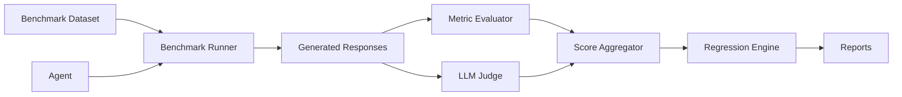
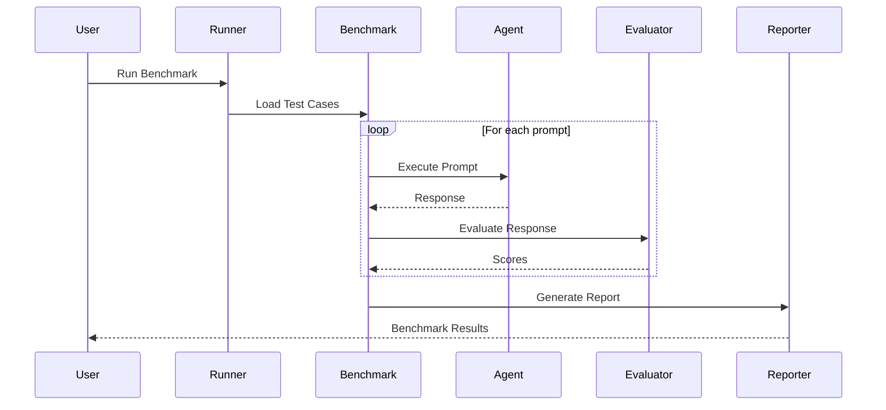

# Multi-Agent Evaluation and Regression Testing Framework

## Overview

As AI agents become more capable, evaluating them consistently becomes increasingly difficult. Changes to prompts, model versions, tools, or workflows can improve one capability while unintentionally degrading another. Without a structured evaluation process, these regressions often go unnoticed until they affect end users.

This project provides a reusable evaluation framework for benchmarking AI agents, measuring their performance, and automatically detecting regressions across different versions. While the initial implementation focuses on a Travel Agent, the framework is designed to support any domain by simply adding new benchmark datasets and agent implementations.

The goal is to make agent evaluation repeatable, scalable, and independent of the underlying agent architecture.

---

# Problem Statement

Developing AI agents is an iterative process. Every update—whether it is a prompt change, a new tool, or a model upgrade—can introduce unexpected behavioral changes.

Some common challenges include:

- No standardized way to evaluate agent performance
- Manual testing that is time-consuming and inconsistent
- Difficulty comparing different agent versions
- Lack of regression detection when new changes are introduced
- No unified reporting of evaluation results
- Domain-specific evaluation pipelines that are difficult to reuse

As organizations build multiple AI agents across different use cases, these problems become even more significant.

---

# Solution

This project introduces a modular evaluation pipeline that separates the evaluation process from the agent implementation.

Instead of building evaluation logic into each individual agent, the framework provides a common benchmarking pipeline that can evaluate any agent against a predefined benchmark.

The evaluation pipeline performs the following steps:

1. Loads benchmark prompts and expected outputs.
2. Executes the selected agent against every test case.
3. Collects generated responses.
4. Evaluates responses using configurable metrics.
5. Uses an LLM judge for qualitative assessment when required.
6. Aggregates evaluation scores.
7. Compares results with previous benchmark runs to detect regressions.
8. Generates detailed reports for analysis.

This architecture allows new agents and benchmark suites to be added without modifying the evaluation engine.

---

# Architecture



---

# Project Workflow



---

# Project Structure

```text
project/
│
├── agents/
│   ├── travel_agent.py
│   └── ...
│
├── benchmarks/
│   ├── travel/
│   │   ├── prompts.json
│   │   ├── expected_outputs.json
│   │   └── metadata.json
│   └── ...
│
├── evaluator/
│   ├── metrics.py
│   ├── llm_judge.py
│   ├── regression.py
│   └── pipeline.py
│
├── runner/
│   ├── run_benchmark.py
│   ├── run_regression.py
│   └── run_all.py
│
├── reports/
│
├── configs/
│
└── README.md
```

---

# Evaluation Pipeline

The framework follows a simple evaluation flow:

1. **Benchmark Loading**  
   The benchmark dataset containing prompts, expected outputs, and metadata is loaded.

2. **Agent Execution**  
   The selected agent processes each benchmark prompt and generates a response.

3. **Evaluation**  
   Responses are evaluated using quantitative metrics such as exact match, semantic similarity, latency, or custom validators. Optionally, an LLM judge can provide qualitative evaluation.

4. **Score Aggregation**  
   Individual metric scores are combined into an overall benchmark result.

5. **Regression Testing**  
   Results are compared against a previous baseline to identify performance regressions.

6. **Report Generation**  
   The framework generates machine-readable and human-readable reports summarizing overall performance and per-test results.

---

# Extending the Framework

The framework is designed to be domain independent.

To add support for a new AI agent, a developer only needs to:

- Create a new benchmark dataset containing prompts and expected outputs.
- Implement the corresponding agent interface.
- Configure the evaluation metrics if necessary.

No changes to the core evaluation pipeline are required.

---

# Future Enhancements

The framework is designed to grow with future evaluation needs. Planned enhancements include:

- Multi-turn conversation evaluation
- Tool-calling validation
- RAG evaluation
- Memory evaluation
- Human review workflows
- Parallel benchmark execution
- CI/CD integration
- Dashboard for historical benchmark tracking
- Automated benchmark generation

---

# Conclusion

This framework provides a reusable foundation for evaluating AI agents in a structured and repeatable manner. By separating benchmarking from agent implementation, it enables developers to compare different agent versions, detect regressions early, and maintain consistent performance as systems evolve.

Although the current benchmark focuses on a Travel Agent, the framework is intentionally designed to support multiple domains and can be extended to evaluate virtually any AI agent with minimal additional effort.


